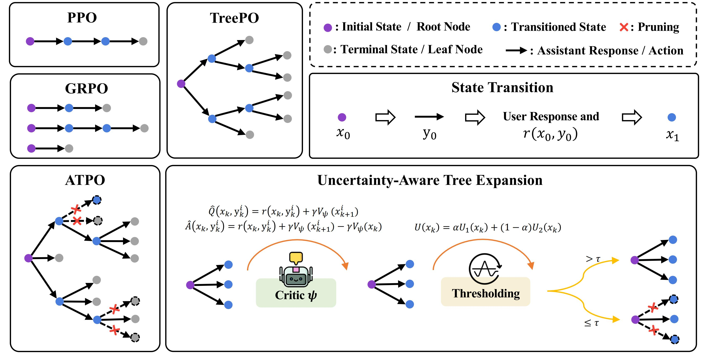

# ATPO: ADAPTIVE TREE POLICY OPTIMIZATION FOR MULTI-TURN MEDICAL DIALOGUE

This repository contains the official implementation code and related datasets for the paper: "ATPO: Adaptive Tree Policy Optimization for Multi-Turn Medical Dialogue".



## Dataset
The datasets used in our experiments are located in the ATPO/dataset directory. They have been meticulously adapted from public benchmarks for the multi-turn medical dialogue task.

```shell
dataset
├── aie_test_dataset.jsonl
├── mcqa_test_dataset.jsonl
├── medqa_test_dataset.jsonl
├── rl_train_dataset.jsonl
└── sft_train_data.jsonl
```
Among them, `sft_train_data.jsonl` is used for SFT cold start, `rl_train_dataset.jsonl` is used for RL training, while `aie_test_dataset.jsonl`, `mcqa_test_dataset.jsonl`, and `medqa_test_dataset.jsonl` are used for model evaluation.

## Algorithm Implementation

The ATPO algorithm is implemented in the ATPO/codes/recipe/atpo directory.
Users can follow the following steps to run the ATPO algorithm:
1. Install the required packages:
```shell
cd  ATPO/codes
pip install -r requirements_atpo.txt
```
> Specifically, we used the code of VeRL with commit id [91ee0a2c08d84b6c9aba97fb1c581c88bdfccb37](https://github.com/volcengine/verl/tree/91ee0a2c08d84b6c9aba97fb1c581c88bdfccb37), and other commit versions near this submission should also be usable.
2. Process the dataset:
```shell
cd  ATPO/codes
export API_KEY=xxxxxxxxxxxxxxx 
# The user here is simulated by the deployed vllm service, and the key is used to access the vllm service.

python3 recipe/atpo/data_utils/mix_data_jsonl.py train ./data/train.parquet ../dataset/rl_train_dataset
python3 recipe/atpo/data_utils/mix_data_jsonl.py test ./data/test.parquet ../dataset/medqa_test_dataset
```
3. SFT cold start:
> ❗ Note: Here we only provide the code related to RL training. For the code related to SFT training, you can refer to [LLaMA-Factory](https://github.com/hipyouga/LLaMA-Factory) or [VeRL](https://github.com/volcengine/verl)

4. RL training:
```shell
cd  ATPO/codes
bash recipe/atpo/run.sh
```
> ❗ Note that here you should modify the `ACTOR_LOAD` in the script to the path of the trained SFT model, and other related parameters can be adjusted according to the situation. In addition, due to security issues, we have anonymized the URL in `/recipe/atpo/api_request_async.py`. Please deploy the service yourself and replace it with the corresponding URL.

## Citation

If you use ATPO or find our work helpful, please cite our paper:

```
@article{cao2026atpo,
  title={ATPO: Adaptive Tree Policy Optimization for Multi-Turn Medical Dialogue},
  author={Cao, R. and Bai, S. and Yao, F. and others},
  journal={arXiv preprint arXiv:2603.02216},
  year={2026}
}
```


